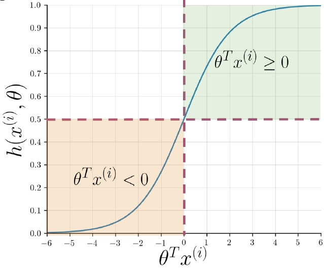

# Logistic Regression

1. Ao executar a regressão logística na análise de sentimentos, representamos cada _tweet_ como um vetor de uns e zeros. No entanto, nosso modelo não funcionou bem. Seu custo de treinamento foi razoável, mas o custo de teste não foi aceitável. Qual poderia ser o possível motivo?

    R: As representações vetoriais são esparsas e, portanto, é muito mais difícil para o seu modelo aprender algo que possa ser bem generalizado para o conjunto de teste.

2. Quais dos seguintes são exemplos de pré-processamento de texto?

    - Stemming, ou seja, o processo de reduzir uma palavra ao seu radical.
    - Lowercasing, que é o processo de remoção de todas as letras maiúsculas para minúsculas.
    - Remoção de stopwords, pontuação, identificadores e URLs.

3. A função sigmoide é definida como $h(x^{(i)},\theta)=\frac{1}{1+e^{-\theta^{T}x^{(i)}}}$. Qual das seguintes opções é verdadeira?

    R: Grande valores positivos de $\theta^{T}x^{(i)}$ farão que $h(x^{(i)},\theta)$ fique mais próximo de 1 e grandes valores negativos de $\theta^{T}x^{(i)}$ farão que o $h(x^{(i)},\theta)$ mais próximo de 0.

4. A função de custo para regressão logística é definida como

$$J(\theta)=-\frac{1}{m}\sum_{i=1}^{m}\left[y^{(i)}logh(x^{(i)},\theta)+(1-y^{(i)}log(1-h(x^{(i)},\theta))\right]$$

Qual das alternativas a seguir é verdadeira sobre a função custo acima? Marque todas as opções corretas.

Quando $y^{(i)}=1$, à medida que $h(x^(i),\theta)$ se aproxima de $0$, a função de custo se aproxima de $\infty$.
Quando $y^{(i)}=0$, à medida que $h(x^(i),\theta)$ se aproxima de $0$, a função de custo se aproxima de $0$.

5. Para qual valor de $\theta^{T}x$ na função sigmoide, $h(x^{(i)},\theta)=0,5$.

$$h(x^{(i)},\theta)=\frac{1}{1+e^{-\theta^{T}x^{(i)}}}$$
$$0,5=\frac{1}{1+e^{k}}$$
$$1+e^{k}=2$$
$$e^{k}=1$$
$$k=0$$

6. Selecione todas as opções aplicáveis. Ao realizar a regressão logística para análise de sentimentos usando o método ensinado nas aulas desta semana, devemos:

- Realizar o pré-processamento de dados.
- Criar um dicionário que mapeia a palavra e a classe em que a palavra é encontrada para o número de vezes que a palavra é encontrada na classe.
- Para cada tweet, devemos criar um **recurso positivo** com a soma das contagens positivas de cada palavra nesse tweet. Devemos também criar um **recurso negativo** com a soma das contagens negativas de cada palavra nesse tweet.

7. Ao treinar a regressão logística, devemos realizar as seguintes operações na ordem.

- Inicializar parâmetros, classificar/prever, obter gradiente, atualizar, obter perda, repetir.

8. Suponha que tenhamos obtido a classificação correta, onde $y^(i)=1$ para algum exemplo específico $i$. Isso significa que $h(x^{(i)},\theta)>0.5$. Qual das seguintes opções deve ser mantida?

- Nossa previsão, $h(x^{(i)},\theta)$ para esse exemplo específico de treinamento, é maior que $(1 - h(x^{(i)},\theta))$

9. Qual é o objetivo da descida de gradiente?

- A descida de gradiente nos permite aprender os parâmetros $\theta$ na regressão logística para minimizar a função de perda $J$.
- Gradient descent, _grad_theta_ allows us update the parameters $\theta$ by computing $\theta=\theta+\alpha\times grand\_theta$.

10. Qual é uma boa métrica que permite decidir quando parar de treinar/tentar obter um modelo?

- Quando tiver um bom desempenho no conjunto de testes.
- Quando o gráfico de custo versus número de interações está convergindo.

